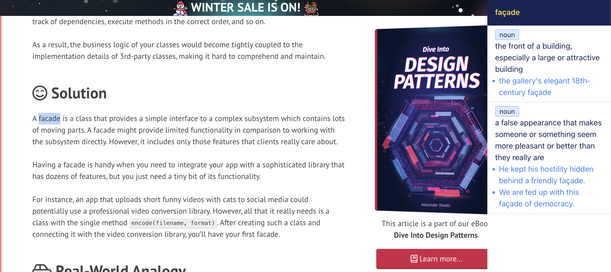

# Quick dictionary
- cd chrome-extension
- yarn install
- yarn build

# Installation

- Open the extension management tab in Chrome.
- Click on "Load unpacked."
- Choose the 'dist' folder generated by 'yarn build.'

# Usage

- Select a word and press CMD + X
- 
